```{r setup}
library(here)
library(ggplot2)
library(patchwork)
library(dplyr)
library(qrcode) # for QR code

source(here("2026_AOS_SoIB/helpers.R"))
```

## {.center auto-animate=true}

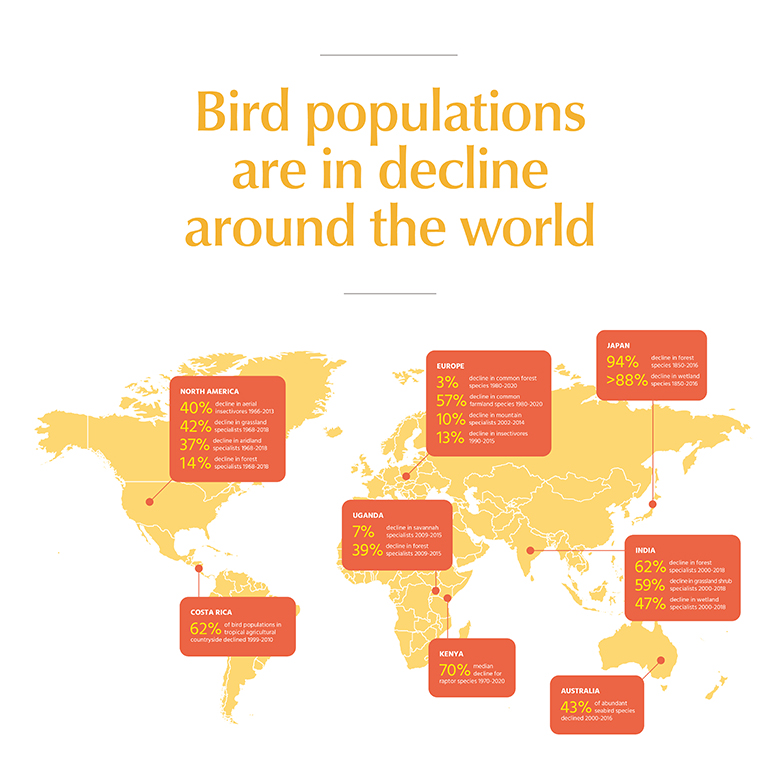{fig-align="center" height=800}
	
::: footer
Source: BirdLife International and Dogeatcog
:::

## {.center auto-animate=true}

::::: {.columns}

:::: {.column width="50%"}

Knowledge-action gap

::: {.fragment}
Wallacean & Prestonian knowledge shortfalls
:::

::::

:::: {.column width="50%"}

{fig-align="left" height=600}

::::

:::::
	
::: footer
Hortal et al. 2015
:::
	
## State of Birds

::: {.fragment}
- Regular status assessments of a region's birds
:::

<br>

<br>

::: {layout="[1, 1, 1, 1]"}

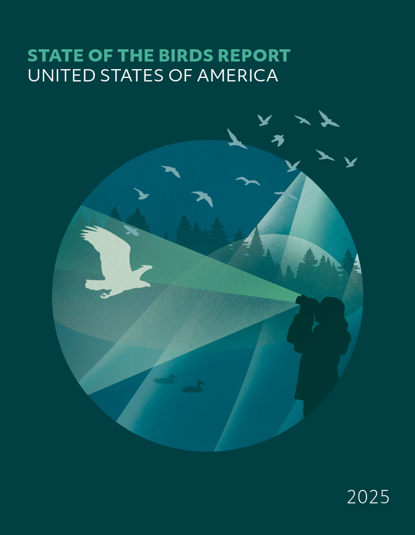{height="500px"}

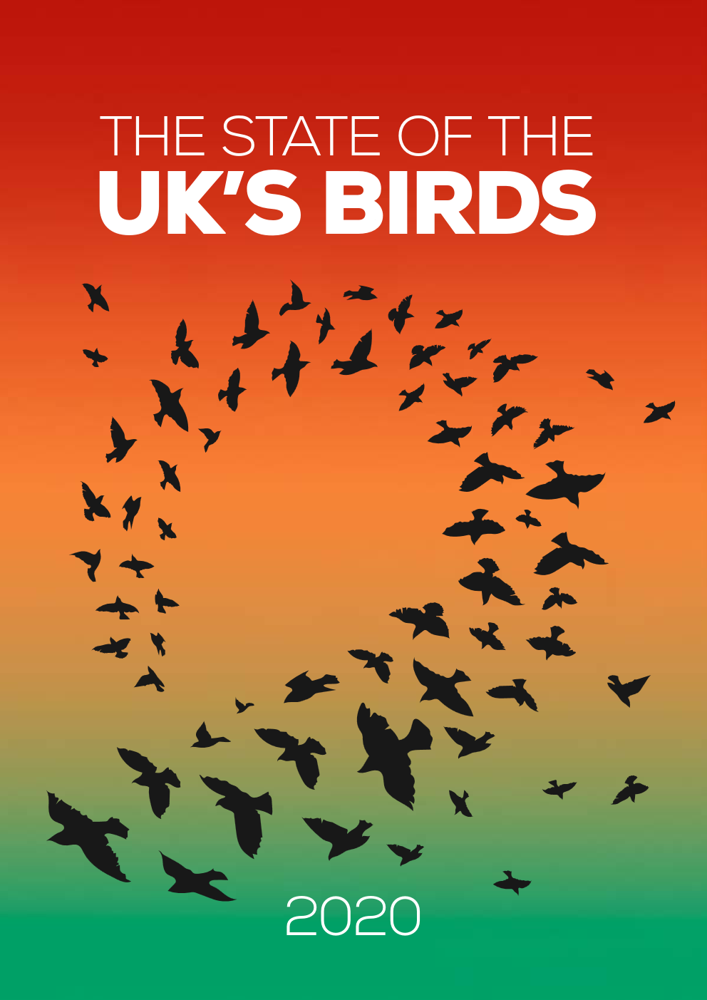{height="500px"}

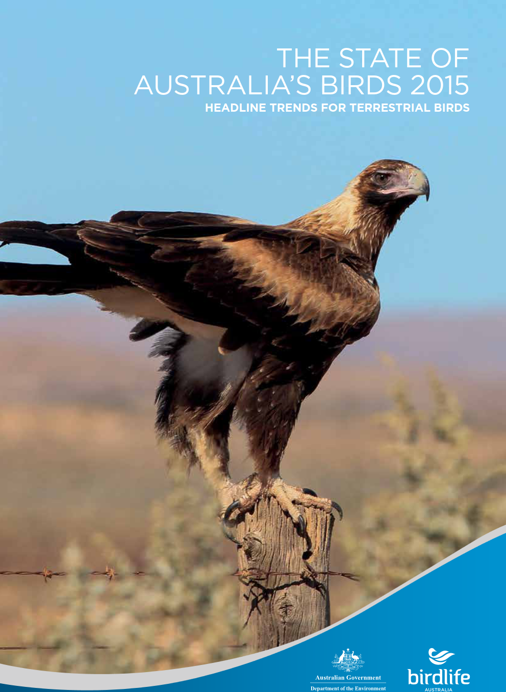{height="500px"}

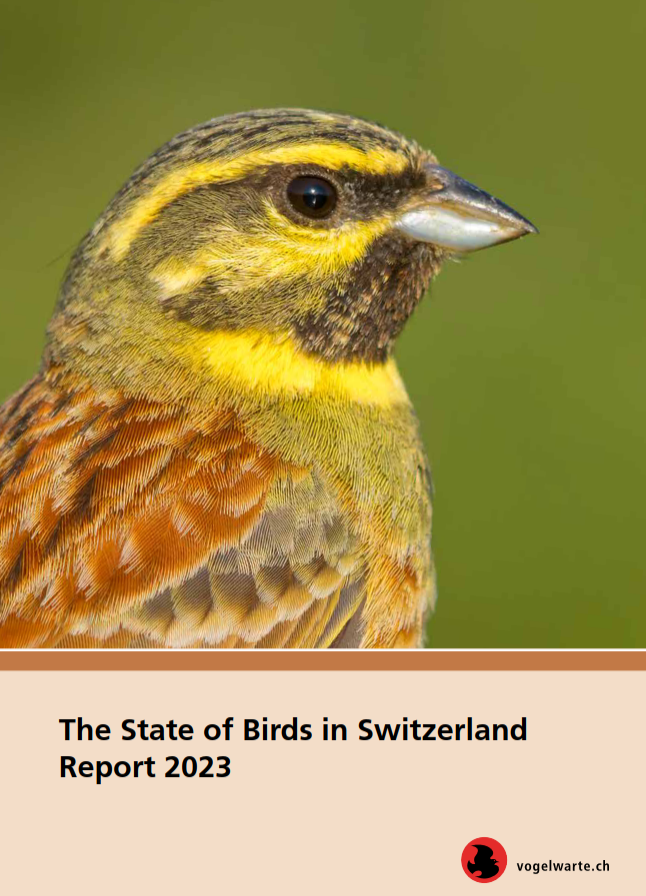{height="500px"}

:::

## State of Birds

- Regular status assessments of a region's birds
- Limited to few parts of the world (**Global North**)
- Large-scale systematic monitoring programmes (**structured data**)

::: {layout="[1, 1, 1, 1]"}

{height="500px"}

{height="500px"}

{height="500px"}

{height="500px"}

:::

## State of Birds

- Regular status assessments of a region's birds
- Limited to few parts of the world (**Global North**)
- Large-scale systematic monitoring programmes (**structured data**)

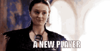{fig-align="center" height=300}

::: {.fragment .fade-in}
**Semi-structured data:** useful, burgeoning resource
:::

## State of Birds

- Regular status assessments of a region's birds
- Limited to few parts of the world (**Global North**)
- Large-scale systematic monitoring programmes (**structured data**)

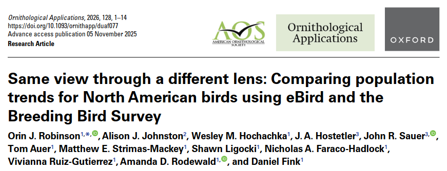{fig-align="center" height=300}

**Semi-structured data:** useful, burgeoning resource *despite analytical challenges and differences*

::: footer
Robinson et al. 2025, Ongole et al. 2026 *preprint*
:::

## {background-image="pics/soib_partners.png" background-size="contain" background-color="white"}

<!-- 14 orgs came together for common goal of bird conservation -->

## The SoIB Partnership {background-image="pics/soib_logo.png" background-size="10%" background-position="top right"}

::: {.incremental}

- Provide **best current knowledge** on status and conservation of India's birds
- **Curating, analysing, and synthesizing available information** to bring out **variety of knowledge products** for use by policymakers, managers, researchers, conservationists, media, and other stakeholders
- Products **freely available**, and represent **state-of-the-art knowledge** on species, habitats, locations, and threats

:::

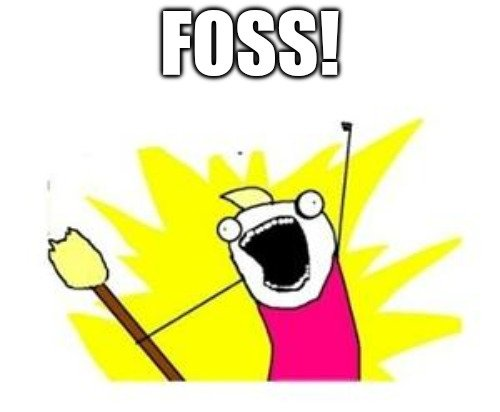{fig-align="center" height=250 .fragment}

## The SoIB Partnership {background-image="pics/soib_logo.png" background-size="10%" background-position="top right"}

- Provide **best current knowledge** on status and conservation of India's birds
- **Curating, analysing, and synthesizing available information** to bring out **variety of knowledge products** for use by policymakers, managers, researchers, conservationists, media, and other stakeholders
- Products **freely available**, and represent **state-of-the-art knowledge** on species, habitats, locations, and threats
- Identify **critical gaps in knowledge** for effective bird conservation in India

# Data-driven research & conservation policy {.section-slide}

## {background-color="black"}

<!-- but where do we start? -->

## {background-color="black" background-image="pics/ebird_global.png" background-size="contain"}

::: footer
Source: [eBird/Cornell Lab of Ornithology](https://ebird.org/news/ebird-passes-2-billion-bird-observations)
:::

## {background-color="black" background-image="pics/ebird_in_coverage.png" background-size="contain"}

::: footer
Source: [Bird Count India](https://birdcount.in/ebirding-india/)
:::

## {.center auto-animate=true}

- Status & trends from eBird: not easy!
- Careful data curation, robust statistics
- Developed methodological framework

:::: {.r-stack}

::: {layout-ncol=2 .fragment height=400}

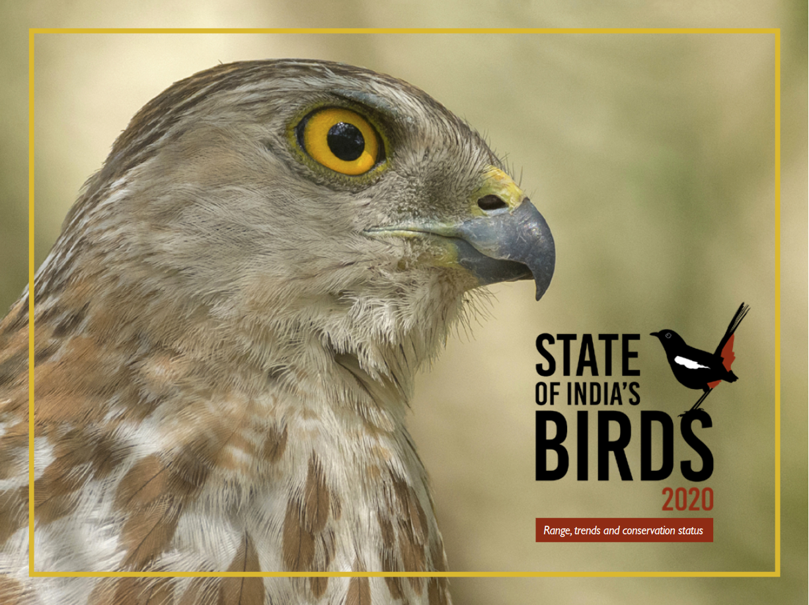{style="box-shadow: 0 4px 10px rgba(0,0,0,0.3); padding: 0px; border: 1px solid #ddd; border-radius: 10px;"}

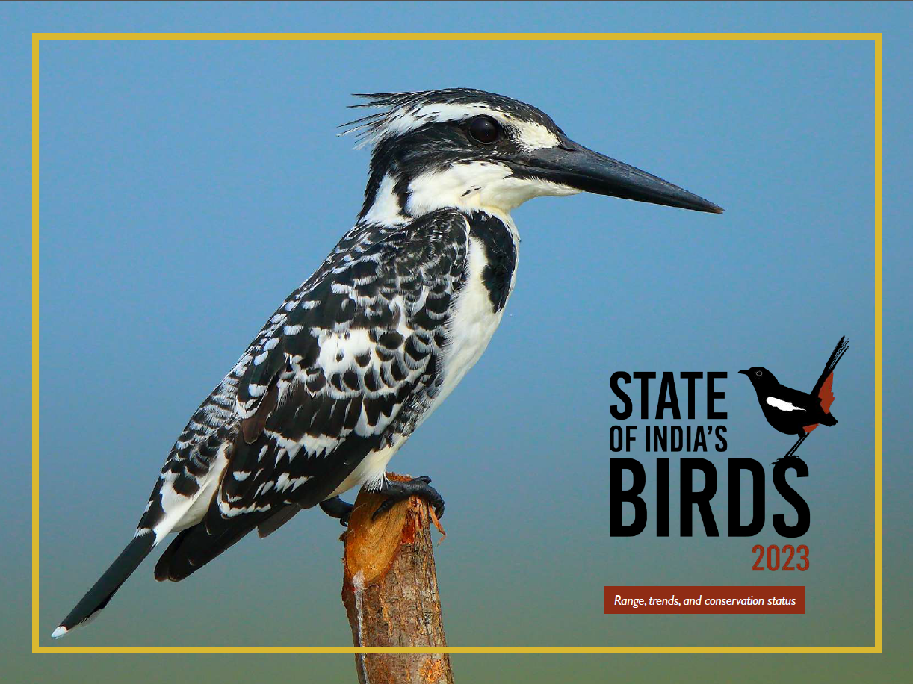{style="box-shadow: 0 4px 10px rgba(0,0,0,0.3); padding: 0px; border: 1px solid #ddd; border-radius: 10px;"}

:::

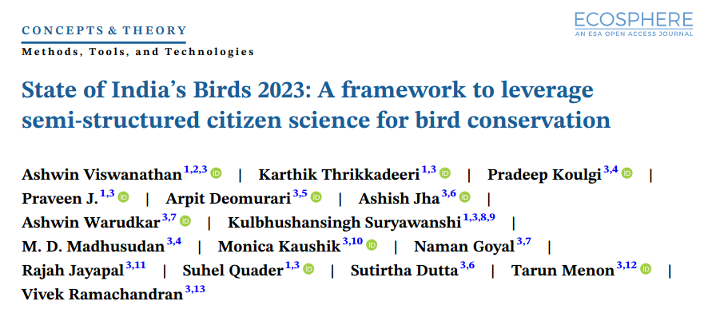{fig-align="center" height=400 .fragment}

::::

<!-- the main eBird analytical framework that produced status & trends assessments was published in detail with the hope that it serves as a blueprint for other regions looking to produce SoB -->

## {background-image="pics/soib_pipeline.jpg" background-position="center" background-color="white" background-size="contain"}

##

:::: {.columns}

::: {.column width="50%" .fragment}

- Approach different from eBird Status & Trends
- Data *curation before modelling*
- Spatial random effects in GLMMs
- Strict sensitivity checks
- Three-way priority classification
- Replicable blueprint!

:::

::: {.column width="50%"}
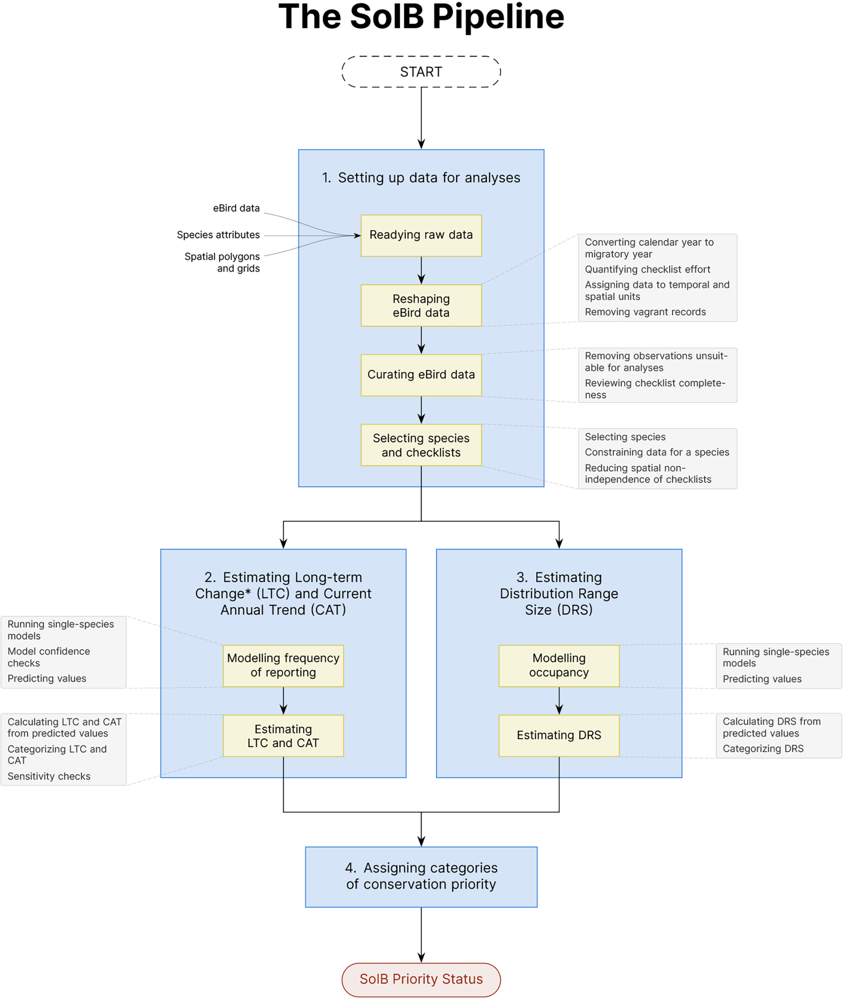{fig-align="right" style="box-shadow: 0 4px 10px rgba(0,0,0,0.3); padding: 0px; border: 1px solid #ddd; border-radius: 10px;" height=800}
:::

::::

# Results {.section-slide background-image="pics/aspr_saumitra.png" background-position="right" background-size="60%"}

(some of 'em)

::: footer
Illustration: Saumitra Deshmukh
:::

## {background-image="pics/soib_highlights.png" background-position="center" background-size="contain"}

::: footer
Illustration: Saumitra Deshmukh
:::

## {background-image="pics/soib_conserv_prior.png" background-position="left" background-size="contain"}

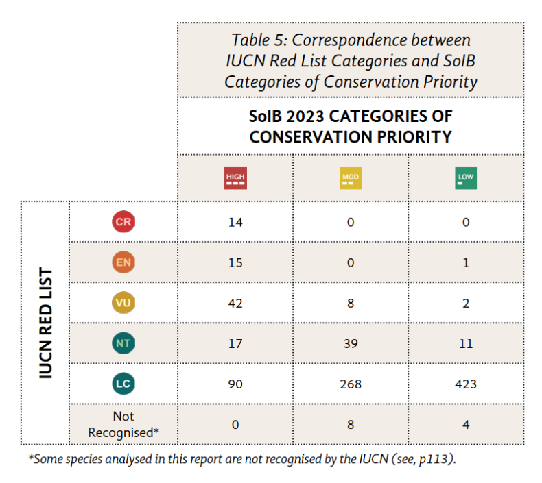{.fragment .absolute bottom=100 right=0 width="50%" style="box-shadow: 0 4px 10px rgba(0,0,0,0.3); padding: 0px; border: 1px solid #ddd; border-radius: 10px;"}

::: footer
Illustrations: Saumitra Deshmukh
:::

## Interpreting long-term change {background-image="pics/Black-Drongo_in_LTT_trend.png" background-size="contain"}

# The Good {.section-slide background-image="pics/section_the_good.png" background-size="contain" background-opacity="90%"}

## {background-image="pics/12_Thriving-Birds_LTT.png" background-size="contain"}

{fig-align="center" height=400 .fragment}

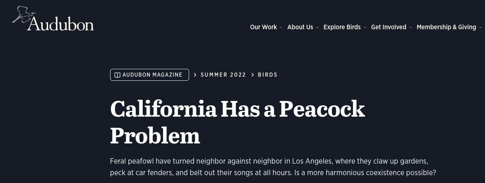{fig-align="center" height=300 .fragment}

## {background-image="pics/01_Diet-Guilds_LTT.png" background-size="contain"}

{fig-align="right" height=300 .fragment}

# The Bad {.section-slide background-image="pics/section_the_bad.png" background-size="contain" background-opacity="90%"}

## {background-image="pics/04_Shorebird-Migratory-Behaviours_LTT.png" background-size="contain"}

{fig-align="center" height=300}

## {background-image="pics/04_Raptors_LTT.png" background-size="contain"}

{fig-align="right" height=300}

## {background-image="pics/01_Open-Ecosystems_LTT.png" background-size="contain"}

{fig-align="center" height=300}

# Open habitat birds, invertivores & raptors in global peril {.section-slide}

## 

::: {layout="[1, 1]"}
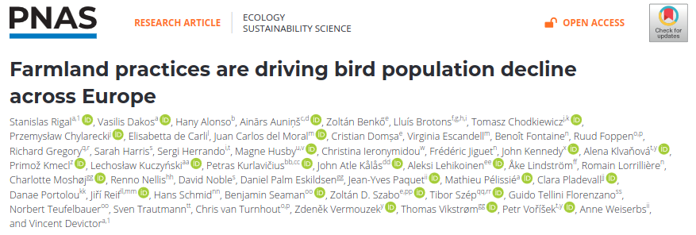

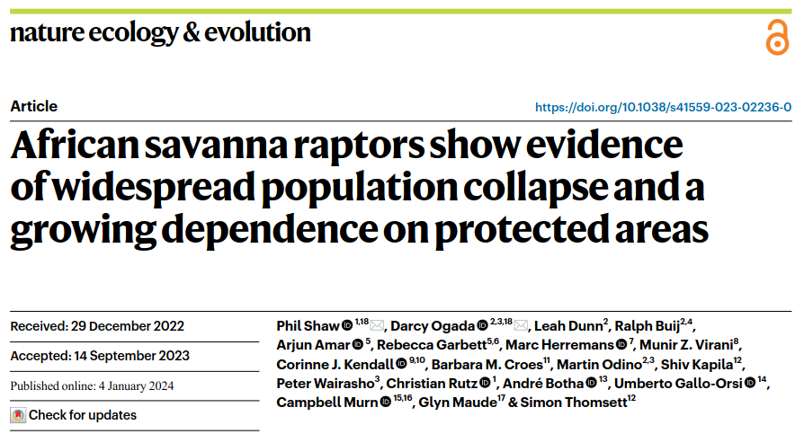
:::

<!-- kestrel, Tawny Eagle and Montagu's Harrier decline in India & Africa, in India WMH also -->

::: footer
Burns et al. 2020, Rigal et al. 2023, Shaw et al. 2024, Bharadwaj et al. 2024
:::

## 

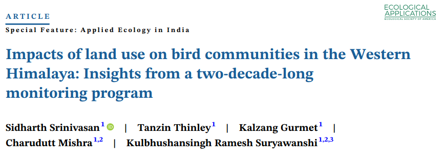{fig-align="center" height=200}

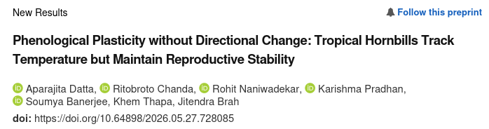{fig-align="center" height=200}

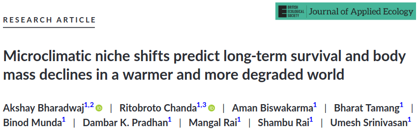{fig-align="center" height=200}

::: footer
Srinivasan et al. 2025, Datta et al. 2026 *preprint*, Bharadwaj et al. 2025
:::

## {.center}

:::: {.columns}

::: {.column width="50%"}
::: {.r-stack}
{style="box-shadow: 0 4px 10px rgba(0,0,0,0.3); padding: 0px; border: 1px solid #ddd; border-radius: 10px;"}

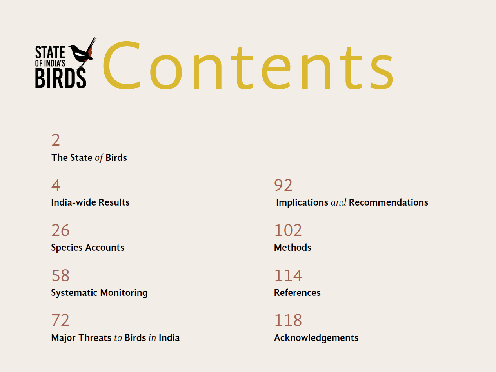{.fragment style="box-shadow: 0 4px 10px rgba(0,0,0,0.3); padding: 0px; border: 1px solid #ddd; border-radius: 10px;"}
:::
:::

::: {.column width="50%" .incremental}

<!-- the report is much more, many more chapters (sysmon, threats, policy). and SoIB is much more than the report (standout product at regular intervals): all results on website, MYNA, -->

- Report is more than status & trends
- SoIB is more than the report

:::

::::

## 



## {background-image="pics/myna_web.png" background-position="center" background-size="contain"}

::: {.r-stack}
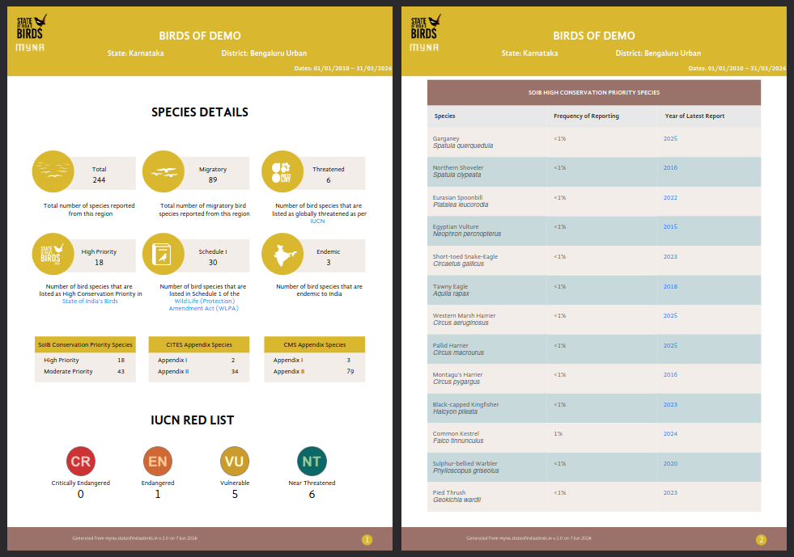{.fragment fig-align="center" style="box-shadow: 0 4px 10px rgba(0,0,0,0.3); padding: 0px; border: 1px solid #ddd; border-radius: 10px; height: 700px;"}

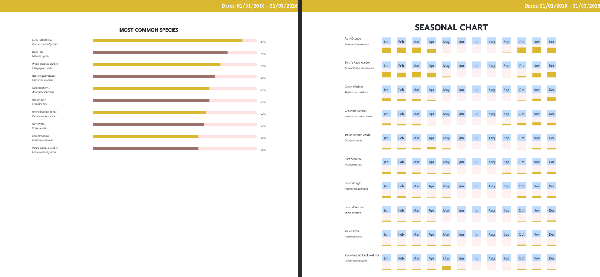{.fragment fig-align="center" style="box-shadow: 0 4px 10px rgba(0,0,0,0.3); padding: 0px; border: 1px solid #ddd; border-radius: 10px; height: 700px;"}
:::

## 

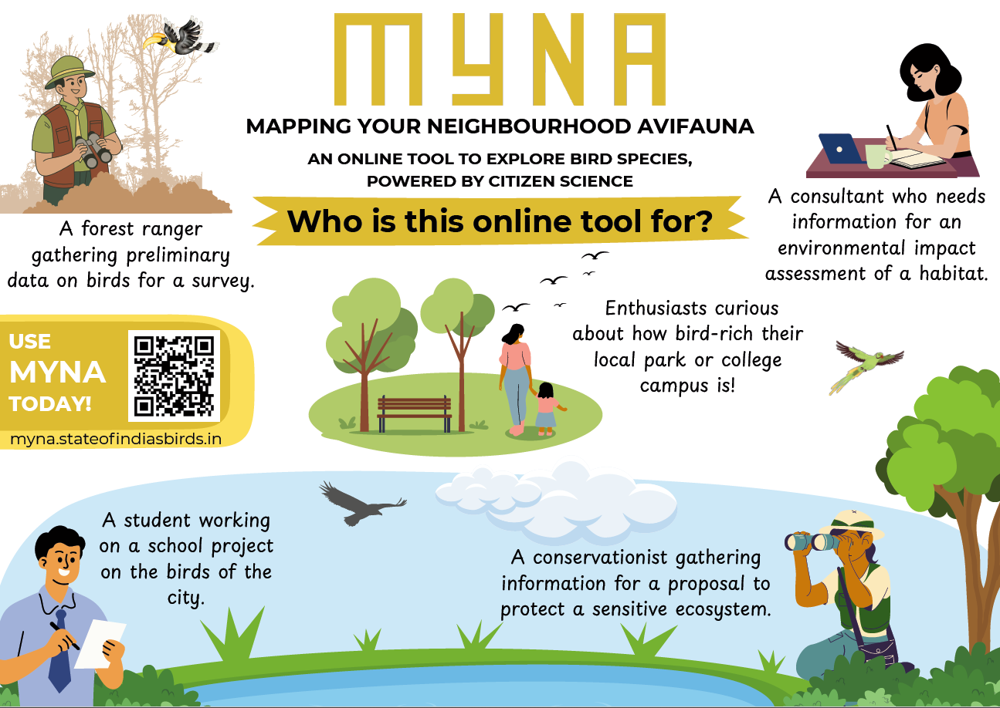{fig-align="center" style="box-shadow: 0 4px 10px rgba(0,0,0,0.3); padding: 0px; border: 1px solid #ddd; border-radius: 10px;"}

## The knowledge gap {background-image="pics/gswo_saumitra.png" background-position="top right" background-size="20%"}

::: {.incremental}
- National + state-wise  products & launches
- Engagement with state- and local-level stakeholders (FD training)
- IUCN Red List reassessment of 9 species
- National Red List
- Proactive partnership of organisations
:::

::: footer
Illustration: Saumitra Deshmukh
:::

## Looking ahead

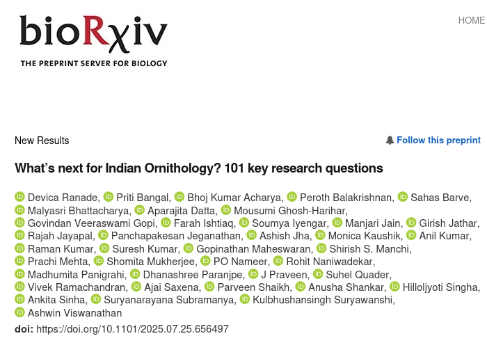{.fragment .fade-out fig-align="center" height=600}

## Looking ahead {background-image="pics/soib_logo.png" background-size="10%" background-position="top right"}

- Near-live MYNA updates (3-month lag)
- Annual data+assessment updates
- Milestone SoIB reports every 3-4 years

::: {.r-fit-text .fragment}
**SoIB 2027**

<br>
:::

# Thank you! {.section-slide background-image="pics/kite_eagle_flipped_saumitra.png" background-size="70%" background-position="100% 80%"}

```{r}
qr_code("https://kartrick.com/slides/2026_aos_soib/") |>
  generate_svg(filename = here("2026_AOS_SoIB/pics/qr_slides.svg"), size = 300,
               foreground = "#443a31", background = "transparent")
```

Find me at...

`r fontawesome::fa("github")` [rikudoukarthik](https://github.com/rikudoukarthik)

`r fontawesome::fa("bluesky")` [kartrick.bsky.social](https://bsky.app/profile/kartrick.bsky.social)

`r fontawesome::fa("globe")` [kartrick.com](https://kartrick.com)

::: {.absolute .smaller top="-90%" left="60%" width="700px"}
Get my slides:

{fig-align="left" height=250}
:::

::: footer

All SoIB illustrations here by Saumitra Deshmukh.

Slides made with &#10084; and `r fontawesome::fa("r-project")` in **Quarto**.

:::

# Appendix {.section-slide visibility="uncounted" #sec-appendix}

## Birders' checklists {visibility="uncounted"}

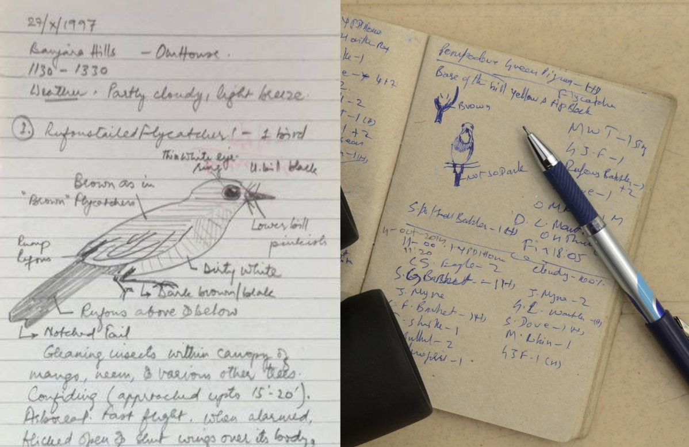{fig-align="center" style="box-shadow: 0 4px 10px rgba(0,0,0,0.3); padding: 0px; border: 1px solid #ddd; border-radius: 10px;"}

::: footer
Source: Aasheesh Pittie (L), P Jeganathan (R)
:::

## Historical data on eBird {visibility="uncounted"}

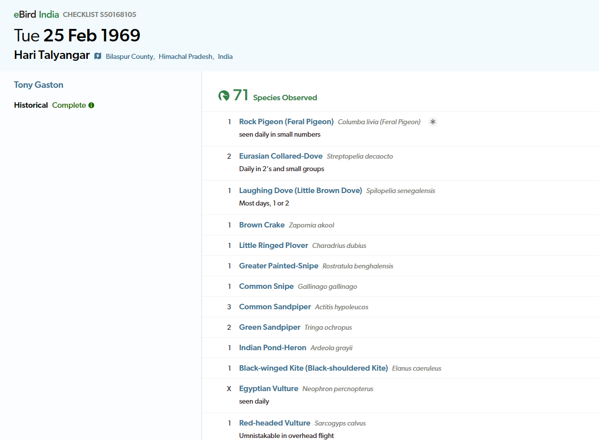{fig-align="center" style="box-shadow: 0 4px 10px rgba(0,0,0,0.3); padding: 0px; border: 1px solid #ddd; border-radius: 10px;"}

## Reporting frequency {visibility="uncounted"}

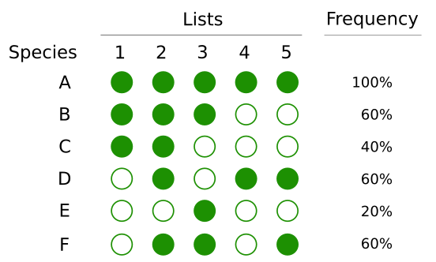{fig-align="center" style="box-shadow: 0 4px 10px rgba(0,0,0,0.3); padding: 0px; border: 1px solid #ddd; border-radius: 10px;"}

## Reducing bias {visibility="uncounted"}

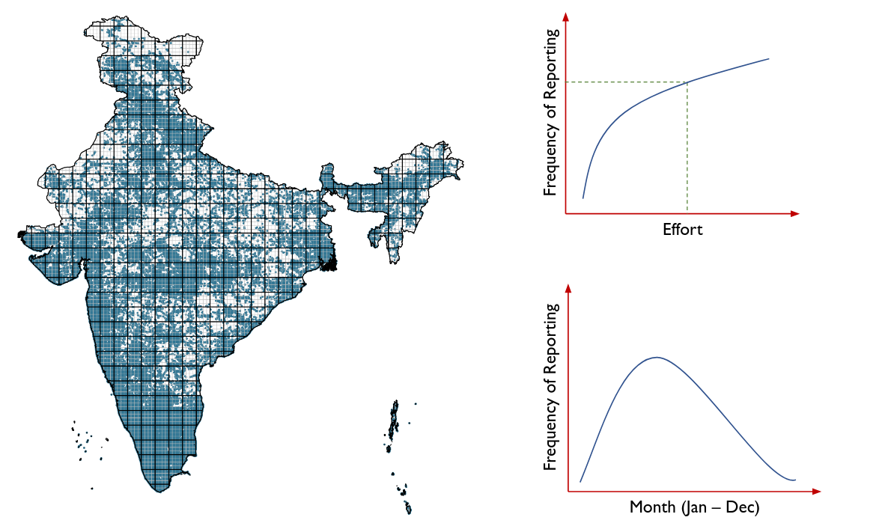{fig-align="center" style="box-shadow: 0 4px 10px rgba(0,0,0,0.3); padding: 0px; border: 1px solid #ddd; border-radius: 10px;"}

<!-- inc. spatial subsampling to reduce pseudoreplication -->

## SoIB 2023 summary {visibility="uncounted"}

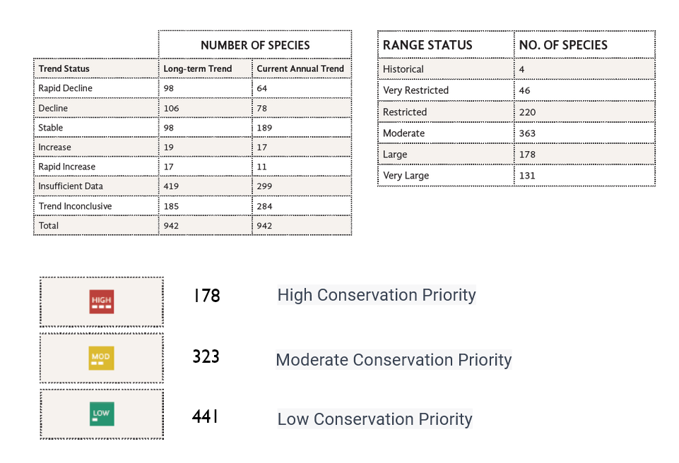{fig-align="center" style="box-shadow: 0 4px 10px rgba(0,0,0,0.3); padding: 0px; border: 1px solid #ddd; border-radius: 10px;"}

## SoIB 2027 sneak peek!

- Analytical improvements: subsampling, checklist centroids, hex-grids
- Data improvements: species attributes
- Data gaps: species, space, habitat, scale ?
- Conservation across space: habitats, protection, urbanisation
- Metrics for conservation: NRL, WPE, WLPA, Wild Bird Index ?
- Demography
- Deeper dives: threats & policy
- ... and more!

## Compute {visibility="uncounted"}

Software Consultant

**Non-profits** must be able to use **any and all compute** capacity available

::: {layout="[1, 1]"}
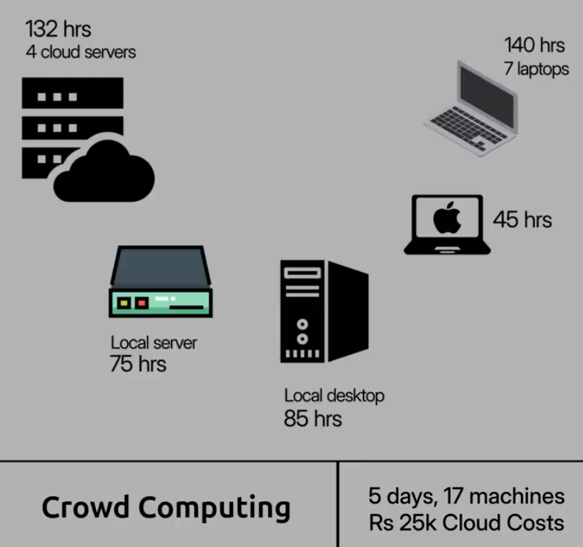{style="box-shadow: 0 4px 10px rgba(0,0,0,0.3); padding: 0px; border: 1px solid #ddd; border-radius: 10px; height: 500px;"}

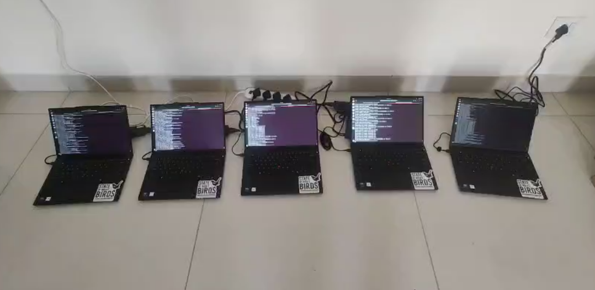{style="box-shadow: 0 4px 10px rgba(0,0,0,0.3); padding: 0px; border: 1px solid #ddd; border-radius: 10px;"}
:::

::: footer
Source: Shree Kumar
:::

## Classification thresholds {visibility="uncounted"}

