```{r setup, include=FALSE}

options(htmltools.dir.version = FALSE)
knitr::opts_chunk$set(
  fig.retina=3,
  out.width = "100%",
  cache = FALSE,
  echo = FALSE,
  include = TRUE,
  message = FALSE, 
  warning = FALSE,
  hiline = TRUE
)
  
library(tidyverse)
library(lubridate)
library(patchwork)
library(xaringanBuilder)
library(here)

# setting the talk folder as root 
i_am("ga2024/index.Rmd")
talk_folder <- "ga2024/"

# devtools::install_github("ropenscilabs/icon")
# icons::download_fontawesome()

# knitr::clean_cache(clean = TRUE)

# plot defaults
theme_set(theme_bw() +
            theme(panel.grid = element_blank(),
                  plot.tag.position = c(0.05, 0.98),
                  legend.position = "bottom",
                  text = element_text(size = 16),
                  legend.text = element_text(size = 12)))

theme_hide <- function () { 
    theme_classic() +
theme(panel.grid = element_blank(),
      axis.title = element_blank(),
      axis.text = element_blank(),
      axis.ticks = element_blank(),
      axis.line = element_blank(),
      plot.tag = element_blank(),
      plot.title = element_blank())
}

# for latency
htmltools::tags$style(".remark-fading{display:none}")

```

class: title-slide, middle, center, inverse
background-image: url("02_pics/agumbe_leaf_shimontika.JPG")
background-position: right
background-size: contain

```{css}

.title-slide {
background-color: var(--primary-pale);
}

.title-slide h2 {
  color: var(--primary);
}

.title-slide h3 {
  color: #856065;
}

.title-slide h4 {
  color: #856065;
}

/* don't know why only h1 and h4 need specification --> */

```

<div class="my-header-left"><i>Slides <a href="https://kartrick.netlify.app/ga2024/">available online</a></i></div>

<div class="my-footer-right">Art: Shimontika Gupta; Photo: Rachit Singh</a></div>

.pull-left[
## Fledging into 
## the World of
## Ecological Research

<br>

<br>

### Karthik Thrikkadeeri
### BSc BCZ (2016--19)

<br>

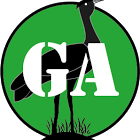

#### Green Army Alumni Talks
#### 16 March 2024
]

---
class: inverse, middle, center

# Chapter 1: Green Army

#### 2016--19

---

.left-column[
- BSc Biotechnology, Chemistry, <u>**Zoology**</u>
]

--

.right-column[
.right[
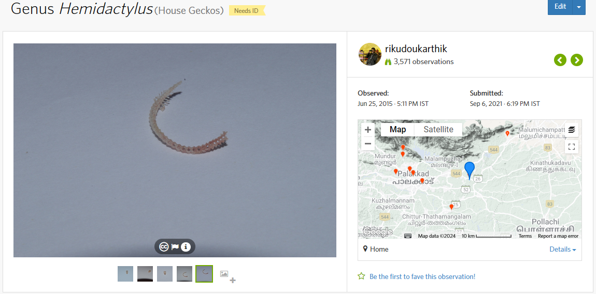

]
]

???

I had some *curiosity* for animals that neither my parents nor I really understood.

---

.left-column[
- BSc Biotechnology, Chemistry, <u>**Zoology**</u>
- Treks & bird/nature walks
]

.right-column[
.left-column[

]
.right-column[


]
]

---

.left-column[
- BSc Biotechnology, Chemistry, <u>**Zoology**</u>
- Treks & bird/nature walks
- Butterflies of Christ University Main Campus
]

.pull-right[
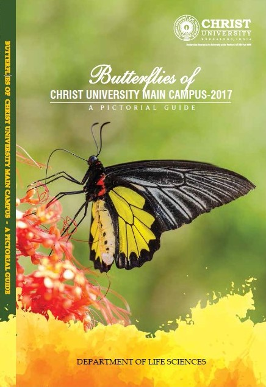
]

---
class: center
background-image: url("02_pics/agumbe_leaf_shimontika.JPG")
background-position: right
background-size: contain

.left-column[
.left[
- BSc Biotechnology, Chemistry, <u>**Zoology**</u>
- Treks & bird/nature walks
- Butterflies of Christ University Main Campus
- Conferences & networking
- Internships
]
]

<div class="my-footer-right">Art: Shimontika Gupta; Photo: Rachit Singh</a></div>

---
class: inverse, middle, center

# Chapter 0: The Ghost of Christmas Past

#### < 2016

---
class: middle, center
background-image: url("02_pics/scientific_method.png")
background-size: contain

???

Old interests that now made sense: favourite subjects in school were Biology, Maths, English

--


---
class: inverse, middle, center

# Chapter 2: MSc Ecology

#### 2019--21

---
class: middle, center

.pull-left[
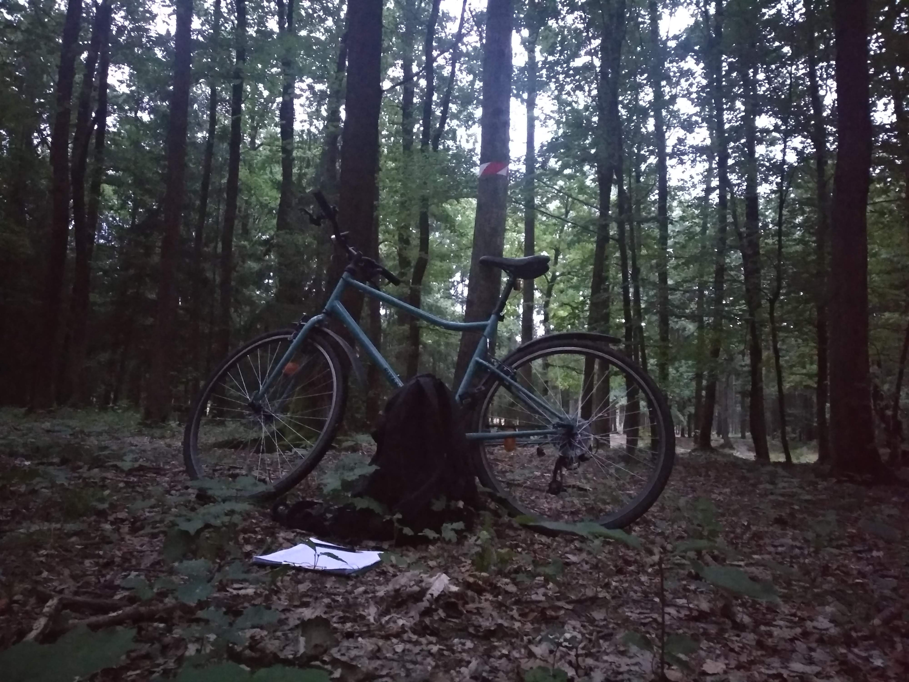
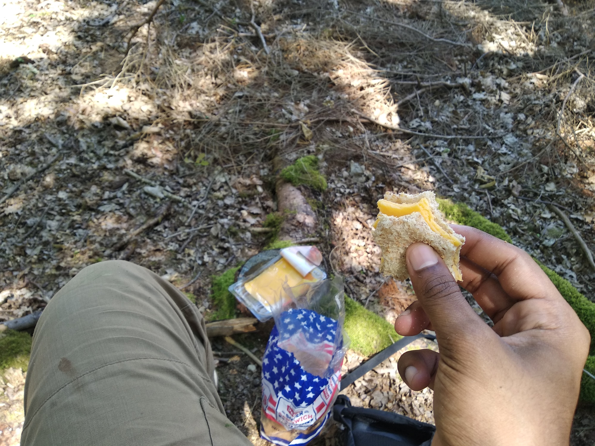
]

.pull-right[
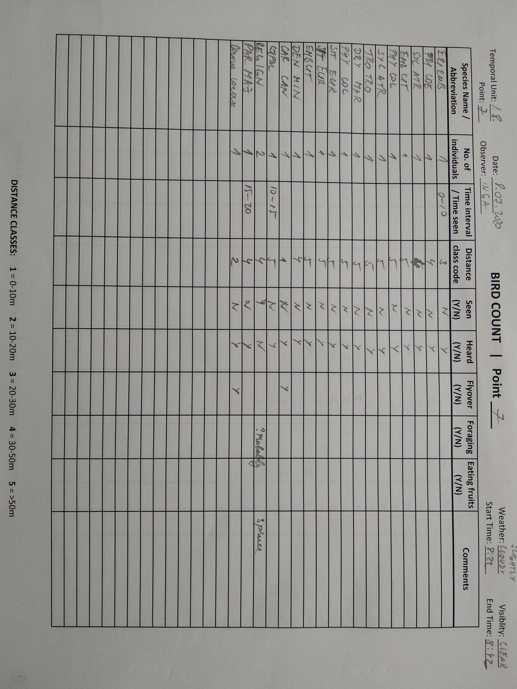
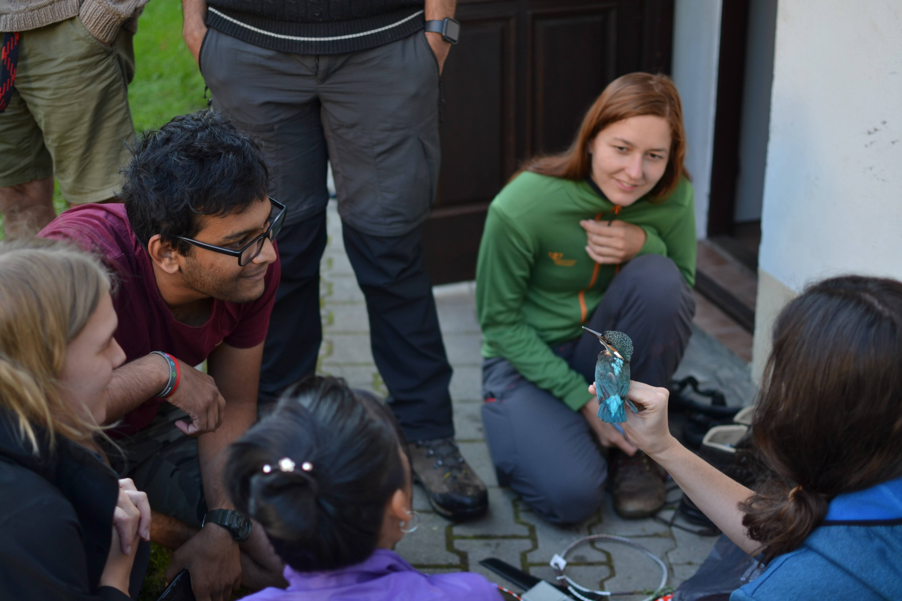

<div class="my-footer-right">Photo: Francisko Rezende</a></div>
]

---
class: inverse, middle, center

# Chapter 3: Nature Conservation Foundation

#### 2021--present

---
class: top, center


--

#### Bird Monitoring team

<br>

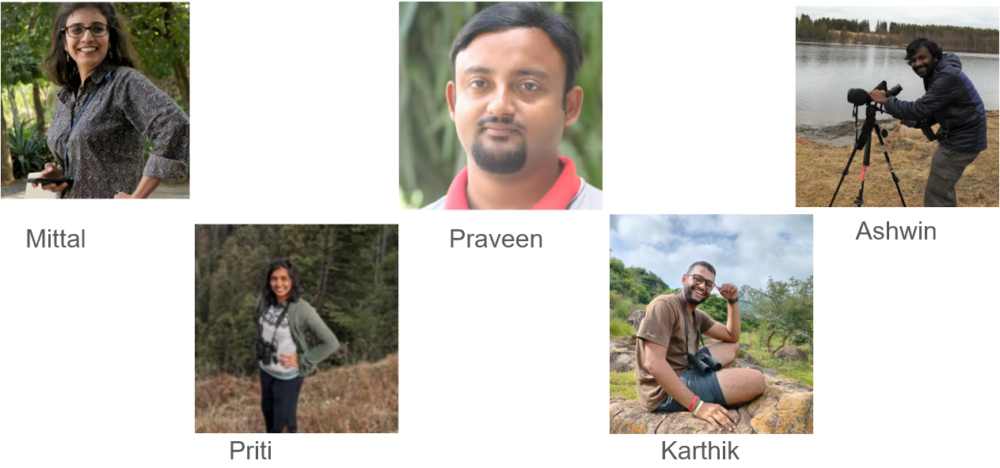

???

A majority of our work so far has involved engaging with Bird Count India, which is a collective of birders and bird monitors engaged in citizen science of birds across the country. Our team rarely ever *conducts* bird monitoring directly, but focuses on facilitating others to do so and to establish bigger, growing communities of interested people. Part of our vision is to empower this rapidly growing community to translate their data into meaningful, actionable insights.

--

```{css}

div.image-right {
content: "";
position: absolute;
bottom: 0px;
right: 0px;
top: 590px;
left: 930px;
height: 20%;
width: 20%;
background-repeat: no-repeat;
background-size: contain;
background-image: url("02_pics/bcilogo.png");
}

div.image-left {
content: "";
position: absolute;
bottom: 0px;
left: 10px;
top: 600px;
right: 900px;
height: 10%;
width: 10%;
background-repeat: no-repeat;
background-size: contain;
background-image: url("02_pics/ebirdindialogo.png");
} 

```

<div class="image-right"></div>  

<div class="image-left"></div>  

---

.pull-left[

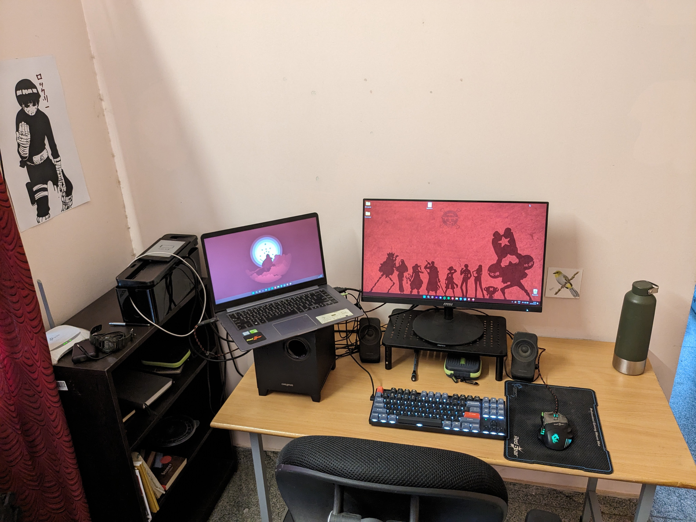

.left[
```{r echo=TRUE, eval=FALSE}
> our_small_dataset
# A tibble: 50,431,050 x 36
```
]


]

.pull-right[
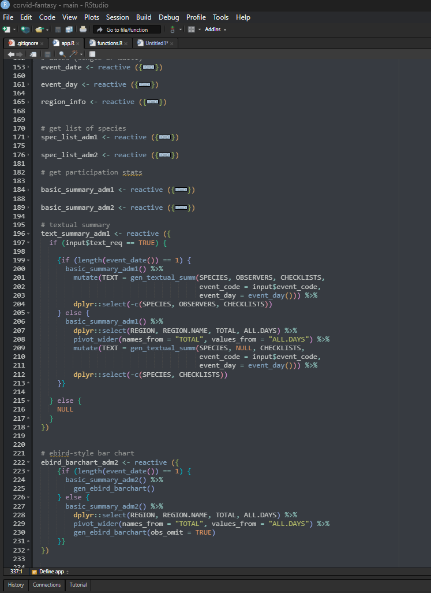
]

???

As such, my role in the team lies more on the (eBird) data side of things: translating the data into outputs of potential use to the community, such as various data products (like reports, maps, graphs, etc.), tools (like an R package and replicable open-source, version-controlled, streamlined data workflows), and knowledge from more formal analyses (like research articles). 

So a day in the life for me would typically involve peering at screens full of data or code, or like many of us, manuscripts-in-progress. I know---not the most inspiring thing, and not what drew me to the field in the beginning! But these are interests I discovered later, and are important parts of doing science. 

---
class: middle, center
background-image: url("02_pics/goldenland.jpg")
background-size: cover

???

Plus, in my off-time I get to travel to crazy places hunting down birds and landscapes, without the hassle of permits and timelines!

--

.pull-left[
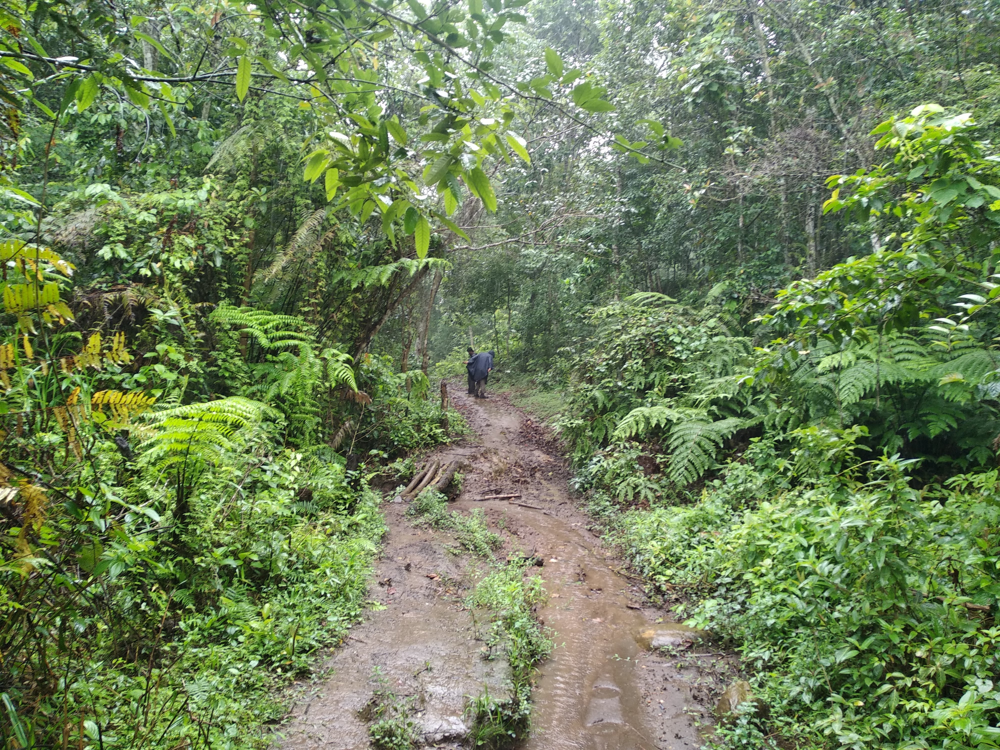
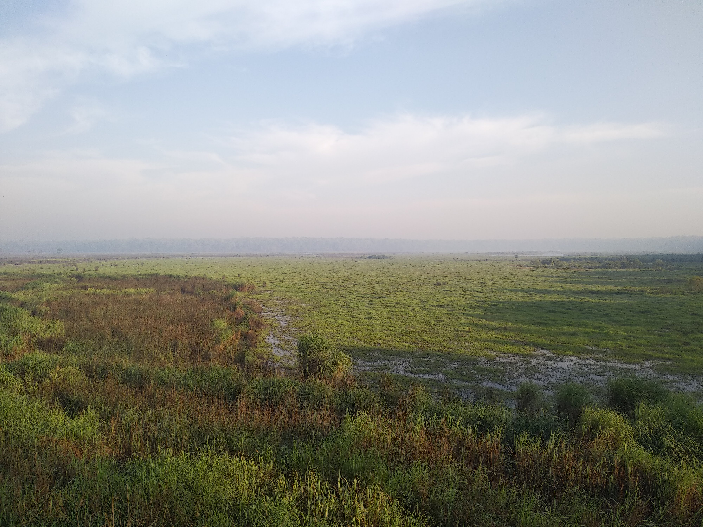
]

.pull-right[
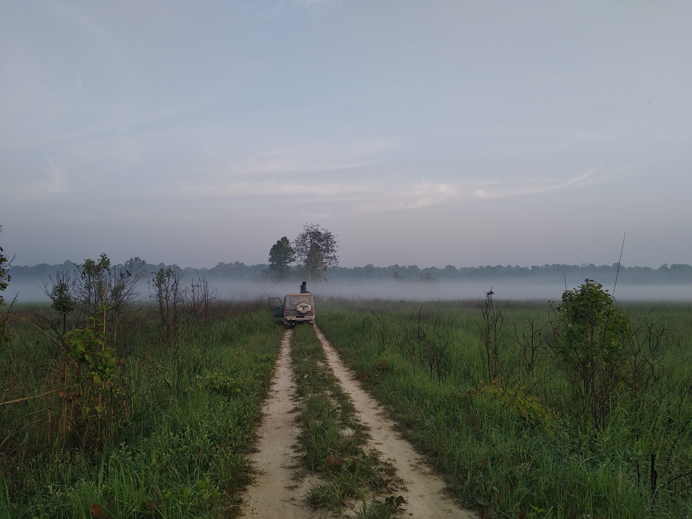
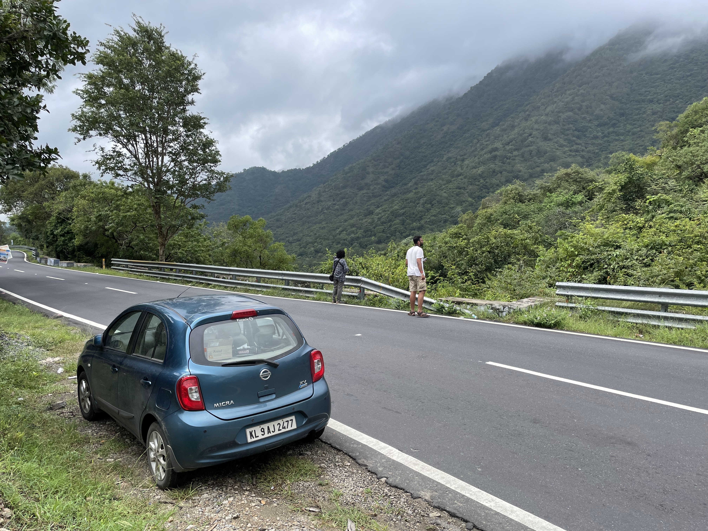
]

<div class="my-footer-right">Photo: Jan Grünwald</a></div>

---
class: middle, center
background-color: var(--accent-pale)

???

I want to tell you all about a specific project I was part of. This is the biggest formal research project our team has been involved in.

---
class: middle, center
background-image: url("02_pics/soib-cover.png")
background-size: contain
background-color: var(--accent-pale)

???

The scope of SoIB actually extends much further beyond NCF---it is a partnership of 13 governmental and non-governmental organisations, among which NCF is but one.

---
class: center, middle

> # .fancy[State of Birds]
> ### .fancy[regular status assessments of a region's birds]

???

Status in terms of abundance and/or range. Elsewhere, these are always done using large-scale systematic monitoring programmes spread across the region of interest.

---
class: center, middle

> # .fancy[State of Birds]
> ### .fancy[regular status assessments of a region's birds]
> ### .fancy[based on large-scale systematic monitoring]

???

Status in terms of abundance and/or range. Elsewhere, these are always done using large-scale systematic monitoring programmes spread across the region of interest.

What is systematic monitoring? This is something very difficult to implement in a huge and diverse country like India.

---
class: middle, center
background-image: url("02_pics/soib_cycle.jpg")
background-size: contain

<div class="my-footer-right">Figure: Raja Bandi</a></div>

???

We figured out an alternative to do this with eBird data, which has been exponentially growing in India in the last few years.

---
class: middle, center
background-image: url("02_pics/soib_summary.png")
background-size: contain

???

Three main metrics: 
- Long-term Change (pre-2000--present)
- Current Annual Trend (2015--2022)
- Distribution Range Size

---
class: middle, center

# Status: India's national bird

<br>

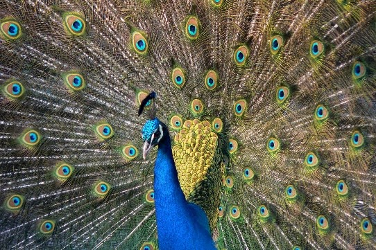

<div class="my-footer-right">Photo: BS Thurber Hof</a></div>

---
class: middle, center
background-image: url("02_pics/inpe_ltt.jpg")
background-size: contain

---
class: middle, center
background-image: url("02_pics/inpe_ka_ltt.jpg")
background-size: contain

???

By the way, SoIB 2023 analyses species not just at the nationwide level, but also at the level of individual states and habitats. This makes it possible to understand how differently a species is faring across states and habitats. For example, we can see here that peafowls have increased more rapidly in Karnataka than in the country overall.

This is also a good example that shows how the metric is an index of abundance, and not exact population estimates. 

---
class: middle, center
background-image: url("02_pics/inpe_br_card.png")
background-size: contain

???

However, in some places the pool of data from birders is not sufficient to conduct these robust analyses. E.g., Bihar.

---
class: middle, center

# Status: Karnataka's state bird

<br>

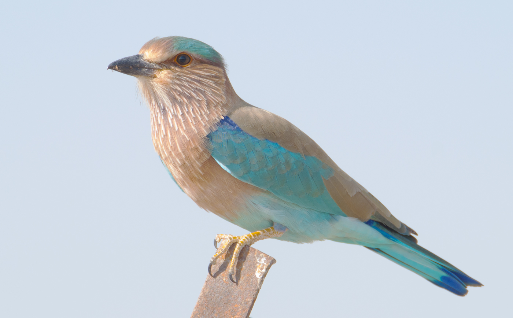

<div class="my-footer-right">Photo: Koshyk / Wikimedia Commons</a></div>

---
class: top, center
background-image: url("02_pics/inro_ltt.jpg")
background-size: contain

???

Indian Roller is a very familiar bird, but not doing very well. Aside from looking at how individual species are doing, we can investigate groups to understand broader patterns. For example, it is an open habitat specialist.

--

### An open habitat specialist

---
class: top, center
background-image: url("02_pics/openhabitatspecies.png")
background-size: contain

### More open habitat species

???

We see similar declines in other species of open habitats as well, that roughly match their degree of specialisation!

---
class: top, center
background-image: url("02_pics/hab_spec.png")
background-size: contain

### Habitat specialisation

???

And when we zoom out to look at different habitat specialisations, here too we notice that the entire groups of open habitat or grassland/scrub specialists are also declining much more than specialists of other habitats. Wetland birds are another group that have declined considerably.

---
class: top, center
background-image: url("02_pics/diet.png")
background-size: contain

### Frugivores &#x1F197; but carnivores &#x1f4c9;

???

Large frugivores could be doing well due to planting of fruiting trees in human inhabited areas. But carrion-eaters and insectivores are generally declining. 

---
class: middle, center

# SoIB is much more!

---
background-image: url("02_pics/soib2023_contents.png")
background-size: contain

---
background-image: url("02_pics/soib_web_allspecies.png")
background-size: contain

???

Anyone can access all the results from SoIB 2023, including maps and graphs, on the website.

---
class: middle, center

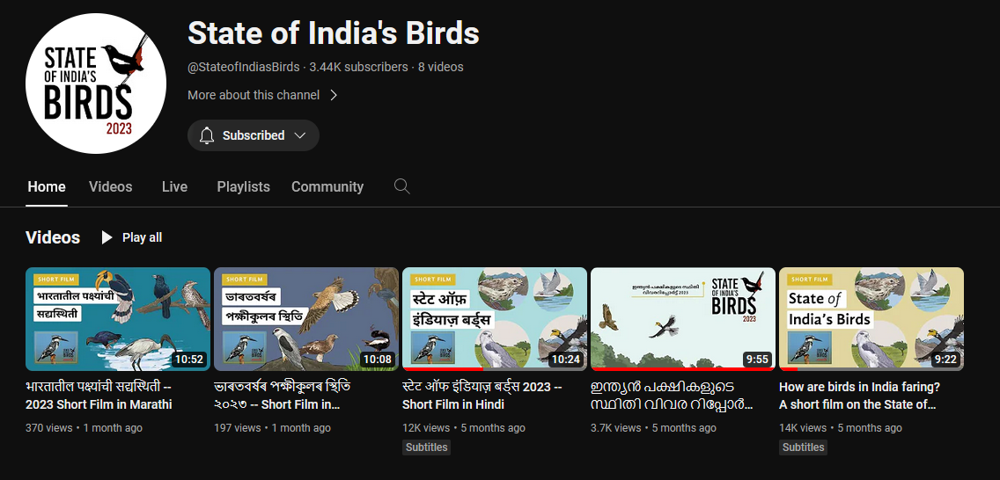

<iframe width="560" height="315" src="https://www.youtube.com/embed/KS70fVQfki0?si=-pmcAnfs6XrdYZ70" title="YouTube video player" frameborder="0" allow="accelerometer; autoplay; clipboard-write; encrypted-media; gyroscope; picture-in-picture; web-share" allowfullscreen></iframe>

???

We also have a YouTube channel where we try to communicate these findings in a way that the information reaches relevant audiences.

---
class: middle, center
background-image: url("02_pics/myna.png")
background-size: contain

<div class="my-header-left"><a href="https://myna.stateofindiasbirds.in/">Go to MYNA!</a></div>

--

.pull-left[
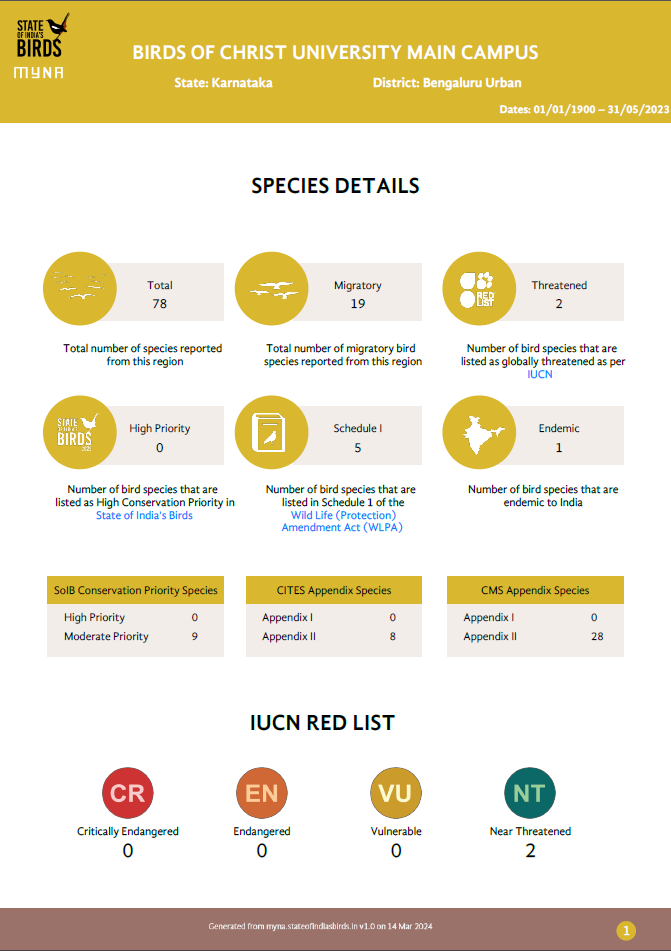
]

.pull-right[
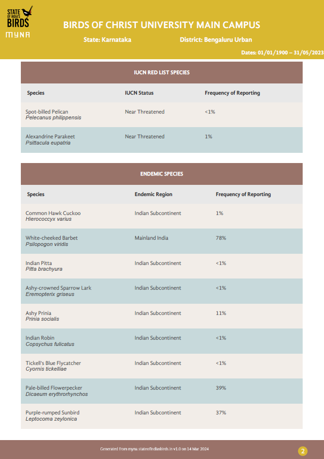
]

???

A tool to generate summarised reports of the birds and their health in a specific area.

---
class: middle, center

# Get involved!

<br>

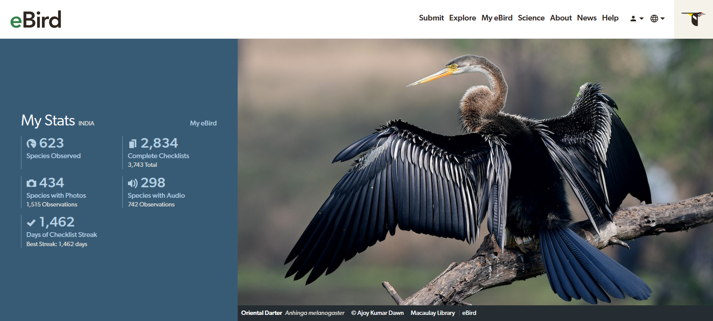

<br>

Start/restart/continue uploading your observations to eBird!

???

Hopefully also inspires ex-birders who have become jaded with birding

---
class: end-slide, inverse, bottom, right

```{css}

.end-slide {
background-color: var(--accent-pale);
}

.end-slide h1 {
  color: var(--accent);
}

.end-slide h4 {
  color: var(--accent);
}

```

.pull-left[
.middle2[
  
.footnote[Image by Gordon Johnson ([source](https://pixabay.com/users/gdj-1086657/?utm_source=link-attribution&amp;utm_medium=referral&amp;utm_campaign=image&amp;utm_content=4220516))]
]
]

# Thank you!

#### Find me at...

.small[`r fontawesome::fa("github")` [@rikudoukarthik](https://github.com/rikudoukarthik)]  
.small[`r fontawesome::fa("twitter")` [@TrickDEerie](https://twitter.com/TrickDEerie)]  
.small[`r fontawesome::fa("link")` [kartrick.rbind.io](https://kartrick.rbind.io)]  
.small[`r fontawesome::fa("envelope")` [rikudoukarthik@gmail.com](mailto:rikudoukarthik@gmail.com)]

.footnote[Slides made with &#10084;, `r fontawesome::fa("r-project")` and [](https://github.com/yihui/xaringan)]

---
class: end-slide, inverse, middle

# Appendix

---
class: middle, center

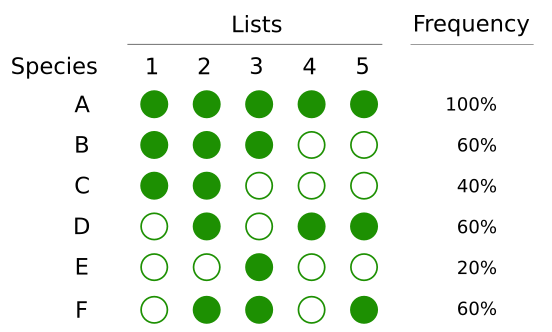

???

From eBird data, we can calculate an index of abundance (aka, reporting frequency) of a species for a specific location and time period, based on all the eBirding that has happened in that space and time.

---
class: middle, center

# Historical lists are critical!

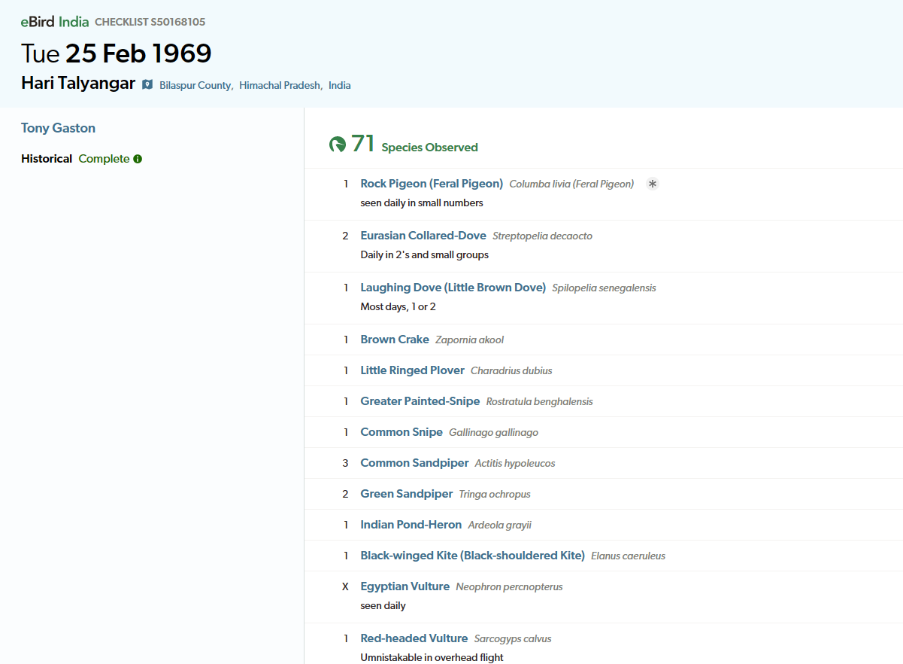

???

People have gone into their old notebooks, and uploaded their very old observations onto eBird. Without this, we wouldn't have been able to even calculate the long-term trends!

---
class: middle, center

.pull-left[
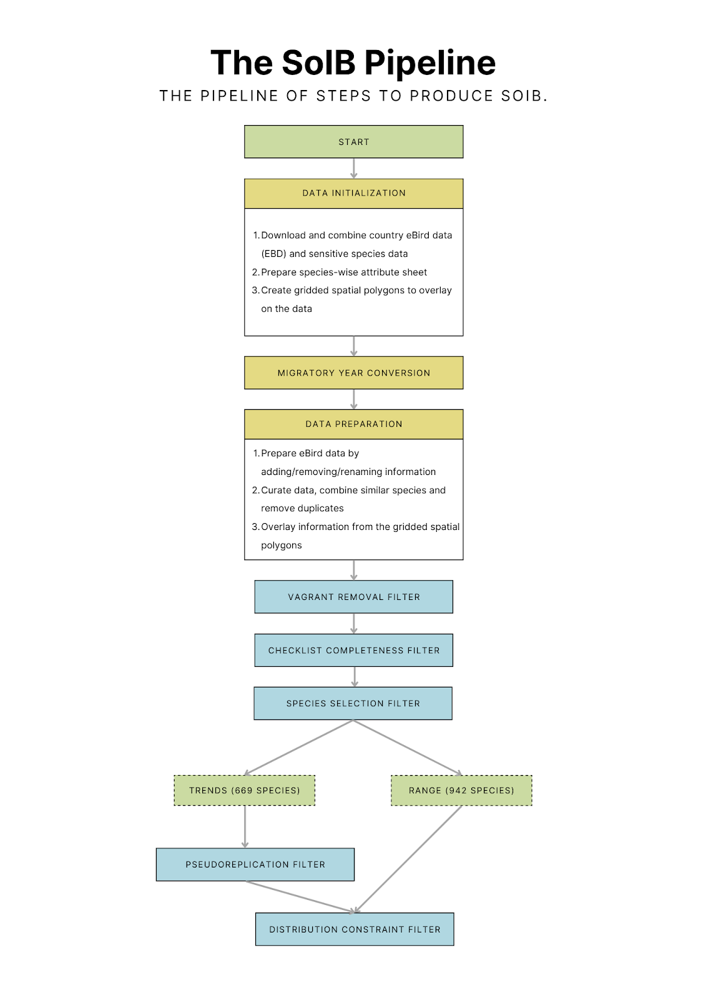
]

.pull-right[
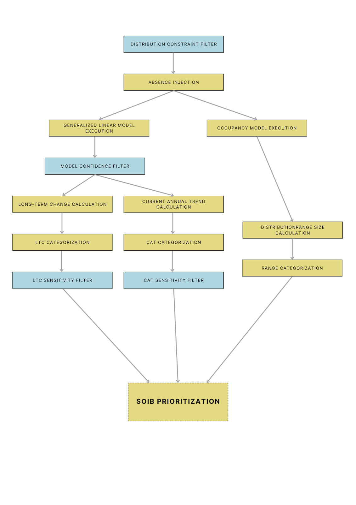
]

<div class="my-footer-right">Figure: Janhavi Rajan</a></div>

???

Three main metrics: 
- Long-term Change (pre-2000--present)
- Current Annual Trend (2015--2022)
- Distribution Range Size

---
class: top, center
background-image: url("02_pics/thrivingbirds.png")
background-size: contain

### Thriving birds

???

The peafowl is on the few bird species in India that are doing well.

---
class: top, center
background-image: url("02_pics/ducks.png")
background-size: contain

### Ducks in decline

???

Unfortunately, the situation is grim for many of our migratory ducks which are in decline.

---
class: top, center
background-image: url("02_pics/wrvu_pas.png")
background-size: contain

### Vultures (relatively) better off in PAs

???

There is some ray of hope: White-rumped Vulture and other vultures seem to be doing better in PAs.
