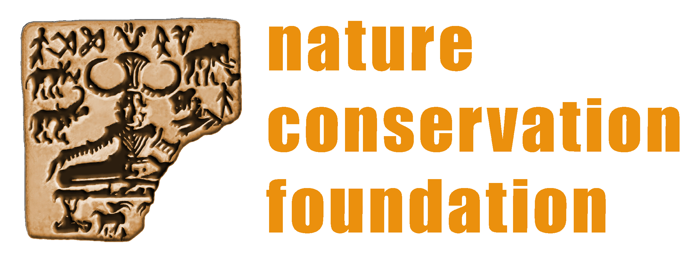

```{r setup, include=FALSE}

options(htmltools.dir.version = FALSE)
knitr::opts_chunk$set(
  fig.retina=3,
  out.width = "100%",
  cache = FALSE,
  echo = FALSE,
  include = TRUE,
  message = FALSE, 
  warning = FALSE,
  hiline = TRUE
)
  
library(tidyverse)
library(lubridate)
library(patchwork)
library(xaringanBuilder)
library(here)

# setting the talk folder as root 
i_am("soib-overview-ga2024/index.Rmd")
talk_folder <- "soib-overview-ga2024/"

# devtools::install_github("ropenscilabs/icon")
# icons::download_fontawesome()

# knitr::clean_cache(clean = TRUE)

# plot defaults
theme_set(theme_bw() +
            theme(panel.grid = element_blank(),
                  plot.tag.position = c(0.05, 0.98),
                  legend.position = "bottom",
                  text = element_text(size = 16),
                  legend.text = element_text(size = 12)))

theme_hide <- function () { 
    theme_classic() +
theme(panel.grid = element_blank(),
      axis.title = element_blank(),
      axis.text = element_blank(),
      axis.ticks = element_blank(),
      axis.line = element_blank(),
      plot.tag = element_blank(),
      plot.title = element_blank())
}

# for latency
htmltools::tags$style(".remark-fading{display:none}")

```

```{r prep, include=FALSE}

# covid_palette <- c("#1B9E77", "#E89005", "#EF4050", "#9678B6")
# covid_labels <- c("Before", "During (2020)", "During (2021)", "After")
# 
# # data objects from https://github.com/rikudoukarthik/covid-ebirding
# load(here(talk_folder, "data/NCF_AM2022_covid.RData"))
# 
# # source("NCF-AM2022-covid/scripts/functions.R")

```

class: title-slide, middle, center, inverse

```{css}

.title-slide {
background-color: var(--primary-pale);
}

.title-slide h1, h2, h3, h4 {
  color: var(--primary);
}

```

<div class="my-header-left">Slides <a href="kartrix-doujutsu.netlify.app/soib-overview-ga2024/">available online</a></div>

# Green Army Talks

<br>

  
.footnote[[Image: Gordon Johnson](https://pixabay.com/users/gdj-1086657/?utm_source=link-attribution&amp;utm_medium=referral&amp;utm_campaign=image&amp;utm_content=4220516)]

<br>

### Karthik Thrikkadeeri

#### GBBC 2024

---
class: middle, center
background-image: url("02_pics/soib-cover.png")
background-size: contain

# SoIB 2023: Overview

<br>

<br>

## Karthik Thrikkadeeri 

## BSc BCZ (2016--19)

<br>

<br>

### Green Army Talks, 18 February 2024

---
class: middle, left

## Bird Monitoring Team, NCF 

## 2021--present



---
class: center, middle

> # .fancy[State of Birds]
> ### .fancy[regular status assessments of a region's birds]

---

Raja's figure (alternative in India using eBird)

---

Status based on three

---

slides 25, 26, 29, 30 (not just national), 32-46

---

slide 47 (change photo) (hopefully inspire people who have become jaded with birding)

---

- other chapters of report

aside from report, a lot of online products
- all species results
- videos in languages
- myna

---
class: middle, center

.pull-right[

.left[


```{r echo=TRUE, eval=FALSE}
> our_small_dataset
# A tibble: 42,423,868 x 37
```

]

]

--

.pull-left[

.middle2[
Data quantity 

Data quality

Bird species reporting
]

]

---
class: middle

```{css}
div.end-image-1 {
content: "";
position: absolute;
top: 150px;
right: 15px;
height: 360px;
width: 360px;
background-repeat: no-repeat;
background-size: contain;
background-image: url("pics/data.gif");
}
```

Data quantity---completely unaffected

<div class="end-image-1"></div>

Data quality---slight changes due to birder behaviour  

Species reporting---largely unaffected at large scale

Care to be taken with small-scale analyses

---
class: center, bottom

## eBird data still useful!

<br>

<br>


---

## Acknowledgements

```{css}

div.ack-funders {
content: "";
position: absolute;
top: 45px;
right: 35px;
height: 250px;
width: 450px;
background-repeat: no-repeat;
background-size: contain;
background-image: url("pics/funders-logos.png");
}

div.ack-self-1 {
content: "";
position: absolute;
bottom: 30px;
left:   100px;
height: 100px;
width: 300px;
background-repeat: no-repeat;
background-size: contain;
background-image: url("pics/ncflogo.png");
}

div.ack-self-2 {
content: "";
position: absolute;
bottom: 30px;
left:   850px;
height: 100px;
width: 300px;
background-repeat: no-repeat;
background-size: contain;
background-image: url("pics/bcilogo.png");
}

div.ack-self-3 {
content: "";
position: absolute;
bottom: 30px;
left: 535px;
height: 100px;
width: 300px;
background-repeat: no-repeat;
background-size: contain;
background-image: url("pics/ebirdindialogo.png");
}

```

#### Funders

- Rohini Nilekani Philanthropies  
- Duleep Mathai Nature Conservation Trust  
- Cholamandalam Investment and Finance Co. Ltd.  
- National Centre for Biological Sciences  

<div class="ack-funders"></div>

<div class="ack-self-1"></div>

<div class="ack-self-2"></div>

<br>

<br>

--

.center[
## Thanks to all birdwatchers and eBird editors!
]

<div class="ack-self-3"></div>

---
class: end-slide, inverse, bottom, right

```{css}

.end-slide {
background-color: var(--accent-pale);
}

.end-slide h1 {
  color: var(--accent);
}

.end-slide h4 {
  color: var(--accent);
}

```

.pull-left[
.middle2[
  
.footnote[Image by Gordon Johnson ([source](https://pixabay.com/users/gdj-1086657/?utm_source=link-attribution&amp;utm_medium=referral&amp;utm_campaign=image&amp;utm_content=4220516))]
]
]

# Thank you!

#### Find me at...

.small[`r fontawesome::fa("github")` [@rikudoukarthik](https://github.com/rikudoukarthik)]  
.small[`r fontawesome::fa("twitter")` [@TrickDEerie](https://twitter.com/TrickDEerie)]  
.small[`r fontawesome::fa("link")` [kartrick.rbind.io](https://kartrick.rbind.io)]  
.small[`r fontawesome::fa("envelope")` [rikudoukarthik@gmail.com](mailto:rikudoukarthik@gmail.com)]

.footnote[Slides made with &#10084;, `r fontawesome::fa("r-project")` and [](https://github.com/yihui/xaringan)]

